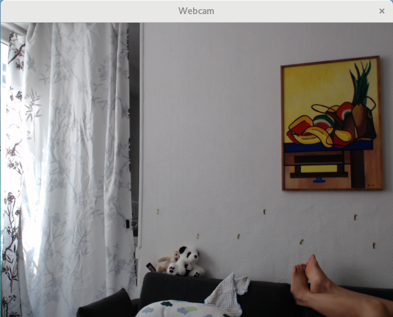
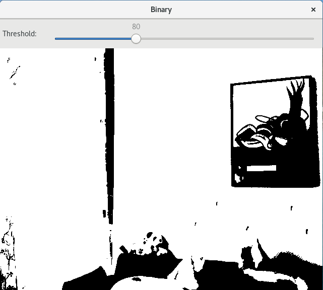

# cvThresh

## What is it ?

<p align="center">
    
</p>

<p align="center">
    
    
</p>

## How to install and run

Clone this repo and build the project by writing in a terminal:

```
mkdir build
cd build
cmake ..
make
```

Check your webcam is well plugged and run this project by writing:

```
./cvThresh
```
